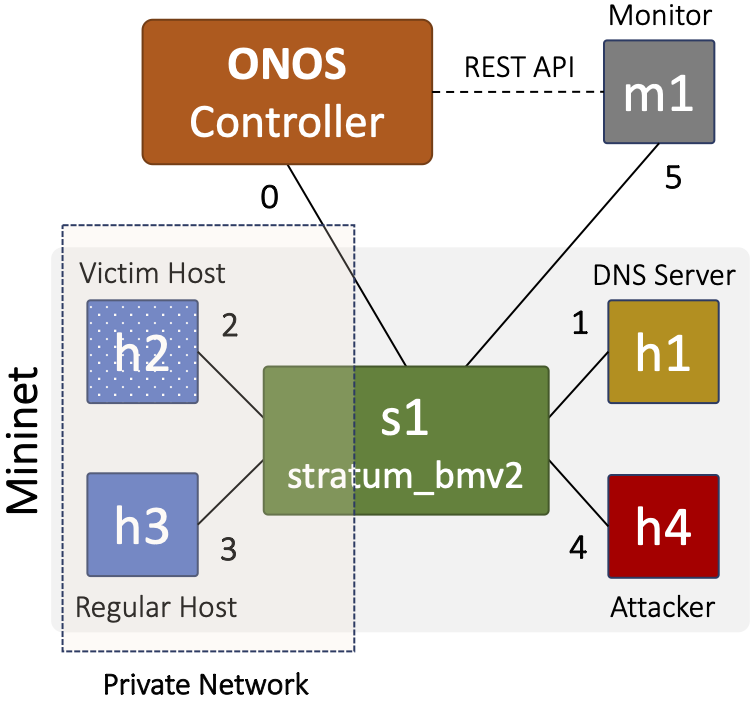

# Assignment 3: DNS Reflection Attacks' Detection and Mitigation
 
DNS reflection/amplification attacks are a specific kind of DDoS attack that uses DNS servers to flood a victim service or host with many DNS reply packets. In this assignment, you will learn a technique to detect and mitigate DNS reflection attacks. You will apply this technique on an emulated Mininet network, using P4 programmable switches, in-band telemetry (INT), and ONOS.

> **NOTE:** You may work in a team of **TWO** if you would like (this is strongly suggested but not required; grading will only be based on your submission regardless of the size of the team).

## Background

In a DNS reflection attack, an attacker sends a DNS request to a DNS server with the source IP address spoofed to the victim's IP address. The DNS server then sends the reply to the victim. The attacker can use many compromised machines (botnets) to generate a vast number of such requests, which results in an overwhelming amount of traffic (DNS responses) headed towards the victim's machine.

In addition to this reflection component, the attack also involves "amplification." The size of each DNS response is typically larger than the size of each corresponding request. As a result, even if the attacker launches the attack from a single compromised machine, the attack will result in more traffic (by bytes) reaching the victim than was sent by the attacker. The amplification effect, and therefore the power of the attack, becomes even more pronounced when the attack is launched from many machines.

### a. Detection

One way to detect DNS reflection attacks is to keep track of the DNS requests and responses that each host sends and receives. Suppose a switch sends a copy of a DNS packet that it sees to a monitoring service, running alongside the network controller. The service can record, for each host, the identification number of each outgoing DNS query. If a DNS response's identification number does not match any of the at-large requests recorded for its destination, the service will increment a counter. If the counter passes some threshold, the service may determine that the host is receiving unsolicited responses and is thus a victim of a reflection attack.

### b. Mitigation

One way to mitigate DNS reflection is to identify and drop the attack traffic at the switch. More specifically, in the scenario described above, once the service detects an attack towards a specific host, it can ...

1. Install a rule on the switch to drop all DNS **responses** destined to the victim host, exceeding the threshold.
2. Install a higher priority rule to allow only those **responses** that match the ID of the legitimate DNS **queries**, originating from hosts.

## Getting Started

### Part A: Virtual environment and network topology
This assignment builds on [`assignment0`](../assignment0), so please ensure that you have a successfully working virtual environment. *Although it follows from the previous assignment, you'll have to rerun the instructions from the current `assignment3` folder.* We will be building a slightly different network this time, as depicted in the following figure.

<br>

- On the first terminal, start the ONOS controller:
  ```bash
  $ cd public/assignments/assignment3
  $ sudo make controller
  ```

- On the second terminal, start mininet:
  ```bash
  $ cd public/assignments/assignment3
  $ sudo make mininet
  ```

- Let the controller know about the Mininet switch `s1` using the `netcfg` command. In a new terminal, run:
  ```bash
  $ cd public/assignments/assignment3
  $ sudo make netcfg
  ```

> **INFO:** You can verify the setup by pinging hosts `h2` and `h3`.

### Part B: Generating DNS reflection attacks

In this setup, `h2` and `h3` constitute your private network through `s1`. `m1` is the monitoring service connected to `s1`, which will listen to all the incoming and outgoing DNS traffic of your network. `h1` is a host that is running an open DNS resolver (i.e., [`bind`](https://en.wikipedia.org/wiki/BIND)), and `h4` is an attacker.

You can start this setup by running the following command in a new terminal:

```bash
$ cd public/assignments/assignment3
$ sudo make setup
```

> **INFO:** Give it a minute or so to finish.

Once started, `h2` and `h3` will begin sending DNS requests every 5 seconds and pings every 2 seconds to the DNS resolver `h1`. At the same time, `h4` will start sending spoofed DNS requests on behalf of `h2` to the DNS resolver every half a second. Thus, `h2` is going to be the victim of a DNS reflection attack.

Under the [`logs`](logs) folder, you will see that the `h2_ping.txt` and `h3_ping.txt` files have a record of successful pings, and the `h2_test.txt` and `h3_test.txt` files have a record of DNS responses and pings. 

After letting the setup run for a couple of minutes, you can then plot a time-series of DNS response counts using the following command:

```
$ cd public/assignments/assignment3
$ sudo make plots
```

Doing so will generate a plot, named `dns_response_rates.png`, under the [`logs`](logs) directory. Examining the plot, you will see that `h2`, the victim host, receives a lot more DNS responses than `h3`.

> **INFO:** To copy the `*.png` file from the AWS EC2 instance to your local machine, run the following command: `scp -i <aws-key> <username>@<ec2-address>:<remote-file> <local-dir>`. For example:
> ```bash
> $ scp -i my-aws-key.pem ubuntu@compute.amazonaws.com:/home/ubuntu/work/assignments/logs/dns_response_rates.png ./
> ```

Finally, terminate the setup by exiting `mininet`. It will remove all the intermediate files and folders, including the [`logs`](logs) folder, upon exit. 

### Part C: Detection and mitigation

The monitoring service needs to analyze the DNS traffic coming from switch `s1` and install flow rules to drop attack packets. The monitoring service runs the Python script, [`py-src/start_dns_monitor.py`](py-src/start_dns_monitor.py). This script uses a Python library, called [Scapy](https://scapy.net/), to sniff packets from the network interface, connected to `s1`, applies the [`handle_packet()`](py-src/start_dns_monitor.py#L50) method to each packet, and install rules to `s1` to allow or drop DNS traffic. You have to add code for the following:

- Install rules in switch `s1` to clone all incoming and outgoing DNS traffic to the monitoring service.
- Implement the DNS reflection attack detection and mitigation strategy described in the [Background](#background) section above.

> **INFO:** Do not modify any existing code, except the required `TODOs` in [`py-src/start_dns_monitor.py`](py-src/start_dns_monitor.py), as it is necessary for correct packet processing.

#### a. Detection

For DNS reflection detection, check each packet arriving at the monitoring service to see if it is a DNS request. If it is, record a mapping from the request's DNS identification number to its source IP.

On the other hand, for each DNS response packet, check whether there has been a request with the same identification number from the destination IP of the response. Keep track of the total number of unmatched responses sent to each host. If this number passes **50** for any host, mitigation should be started for that host (see [Mitigation](#mitigation-1) below).

There are three `TODO` sections in [`py-src/start_dns_monitor.py`](py-src/start_dns_monitor.py). The [first](py-src/start_dns_monitor.py#L62) is in the `if __name__ == "__main__":` section. This is where you have to call `rest.install_rule()` to install rules in the `monitor` table of switch `s1`, via a REST API, to clone DNS packets to the monitoring service. 

> **INFO:** You can clone DNS packets by installing a rule in the `monitor` table (using the ONOS `rest` API) that matches the layer-4 port number, 53, which is reserved for [DNS](https://datatracker.ietf.org/doc/html/rfc1035#section-4.2). You can find more information on the `rest` API and examples, [here](py-src/utils/rest.py#L363). **Remember that you will be installing rules in the `monitor` table in switch `s1`.**

The [second](py-src/start_dns_monitor.py#L35) is in the constructor `__init__()`. This is where you should create any instance variables needed for the detection algorithm. These instance variables should start with the keyword `self`, (e.g., `self.id_to_host`). 

> **INFO:** For more information on Python classes, see the documentation here: [A first look at classes](https://docs.python.org/2.7/tutorial/classes.html#a-first-look-at-classes).

The [third](py-src/start_dns_monitor.py#L51) one is in the `handle_packet()` method. Here, you will need to update the instance variables in response to the current packet contents. The `pkt` argument is the current packet encoded in the Scapy packet format. The following example shows how to access the source and destination IP addresses of `pkt`:

```python
# Check whether pkt is an IP packet
if IP in pkt:

  # Get source IP addresses
  src_ip = pkt[IP].src

  # Get destionation IP addresses
  dst_ip = pkt[IP].dst
```

The following example shows how to check whether a DNS packet is a request or a response and how to get its ID:

```python
# Check whether pkt is a DNS packet
if DNS in pkt:

  # Check if pkt is a DNS response or request
  is_response = pkt[DNS].qr == 1
  is_request = pkt[DNS].qr == 0

  # Get ID of DNS request/response
  dns_id = pkt[DNS].id
```

> **INFO:** [Scapy](https://scapy.net/) is a powerful packet manipulation tool that allows you to do more than just inspect packets (although that's all you will be using it for in this assignment). For more information about Scapy, see the documentation here: https://scapy.readthedocs.io/en/latest/.

#### b. Mitigation

Once you detect that a host is being attacked, begin dropping all DNS response traffic destined to that specific host, except the ones for which the monitoring service has seen a legitimate query originating from that host.

Implement packet drops by installing a flow rule to switch `s1` when the unmatched responses go beyond the specified threshold (i.e., 50) for the victim host.

Moreover, to allow legitimate responses to pass through, install a flow rule whenever you see a new DNS query from a host and delete it when you see the corresponding response from the DNS resolver.

> **NOTE:** Although in this specific setup, `h2` is the victim, we may test your assignment using `h3` as a victim. Therefore, your detection and mitigation implementation should not assume a specific host to be the victim. Moreover, you should not have `h2` (or `h3`) specific details (such as IP address) hardcoded in your code.

#### Running the monitoring service

Once you have completed the TODOs, rerun the virtual environment (Part A) and the DNS reflection attacks (Part B).

Let it run for a couple of minutes, and then start the monitoring service on `m1` by entering the following command in a separate shell:

```bash
$ cd public/assignments/assignment3
$ sudo make start-monitor
```

> **INFO:** Run `sudo make stop-monitor` to stop the monitoring service.

After a couple of minutes, run `sudo make plots` to generate a time-series of DNS response counts (`dns_response_rates.png`).

### Part D: Analysis

Answer the questions in the file [`questions.txt`](questions.txt). Put your and your partner's names and UMIDs at the top of the file.

> ---
> #### Debugging tips:
> - **Python**
>   - To debug your code in `start_dns_monitor.py`, you can print informative messages to stdout using `print(message)`. Please remove these prints before submitting these files.
>   - Make sure you are checking whether a packet is a DNS packet before attempting to access its src/dst IP address or its DNS ID.
>   - If you start getting strange errors related to creating threads, restart the virtual environment.
> - **ONOS**
>   - To view if flow rules are successfully installed, run `sudo make cli` to log into the ONOS controller. From there, you can enter `flows -s any` command to list the currently installed rules in switch `s1`.
> ---


## Submission and Grading
Submit `assignment3` using the autograder available at: [g489.eecs.umich.edu](https://g489.eecs.umich.edu)

The autograder allows **one submission per day**. We will consider your **highest-scoring submission**.

> **INFO:** Please avoid using the autograder as a debugging tool. Test your implementation locally before submitting.

**Group Policy**. You may work individually or in groups of up to two students. If working in a group, both partners must be registered together when making the first submission.

**How to Submit (Autograder)**. To submit:

1. Navigate to the `assignment3` directory.
2. Run the provided `submit.sh` script.
3. Submit the generated `submit.tar` file to the autograder.

Example:
```bash
$ cd <path-to-folder>/assignments/assignment3
$ bash submit.sh .
```
Do not modify the `submit.sh` script.

**Written Submission (Gradescope)**. In addition to the autograder, you must complete a written component submitted via [Gradescope](https://www.gradescope.com/courses/1206766/assignments/7856340/).

Your submission should include:
- Answers to all questions in `questions.txt`
- The plot generated after executing `start_dns_monitor.py`

Please submit a single PDF containing all answers and the plot.

**Grading Breakdown**.

- Autograder: 130 points
- Gradescope: 20 points
- **Total: 150 points**

## Acknowledgement

This assignment is modeled after a similar assignment offered at Princeton University by my Ph.D. advisor, Nick Feamster.
