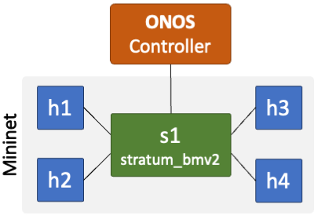
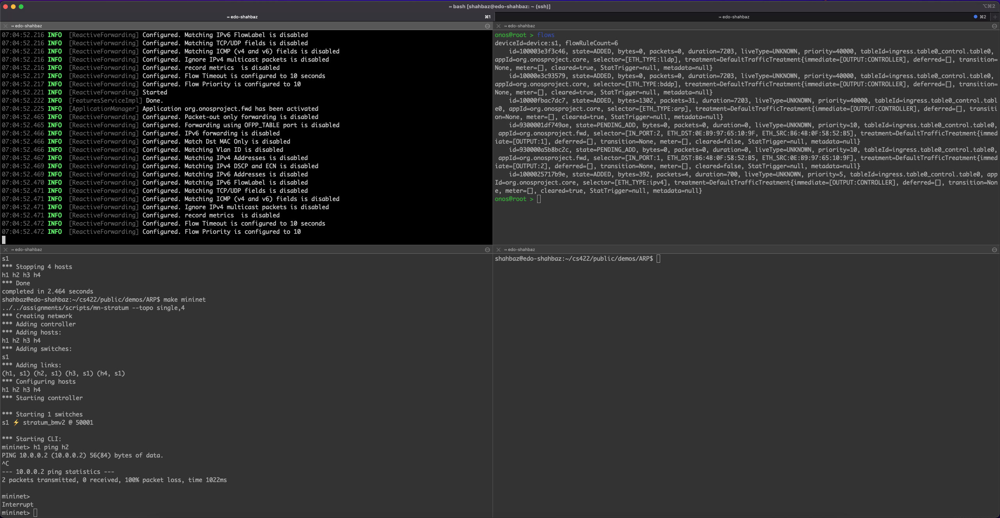
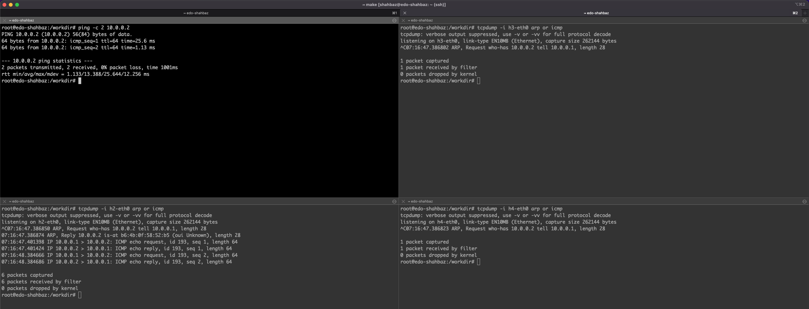

   
# Demo: Address Resolution Protocol (ARP) in Action

In this demonstration, we will see how hosts use Address Resolution Protocol (ARP) to learn about each other's MAC (or Layer 2) addresses, and how switches use the ARP packets to learn about which ports connect to which hosts. In short, ARP serves a dual purpose in this context: it helps (1) build the ARP table at the hosts and (2) populate the Layer 2 learning (or forwarding) table in the switches.

## Testbed and Goals

For this demonstration, we will use the virtual network environment from [`assignment0`](../../assignments/assignment0). However, instead of using two hosts, we will run Mininet with four hosts (see the following topology). 



We will generate ping packets from host `h1` and then monitor traffic on hosts `h2-4` for ARP and ICMP packets (using `tcpdump`). If everything goes as planned, we should be observing the following behavior:

- At host `h1`: its ARP table should now have an entry corresponding to `h2`, listing its MAC address.
- At host `h2`: it should also have a similar ARP table entry, but with host `h1` MAC address. Moreover, we should see both ARP request/reply as well as ICMP packets corresponding to the ping originated from host `h1`.
- At hosts `h3` and `h4`: their ARP tables should not contain any entry for host `h1`. Also, we should only see the ARP request packets on these hosts---they should not generate any ARP replies or receive ICMP packets.
- At switch `s1`: we should see two rules for `h1` and `h2`, matching their MAC addresess and forwarding packets to their respective ports.

> **INFO:** The `ping` command uses ICMP (Echo/Reply) packets for its operations.

Let's see this in action ...

## Start ONOS and Mininet

- First, clone this repository onto your machine. Change into the desired folder and clone the repository using `git`.

```bash
$ cd <path-to-folder>
$ git clone https://gitlab.com/umich-eecs489/winter-2026/public.git
```

- In a first terminal, **start ONOS**:

```bash
$ cd public/demos/ARP
$ sudo make controller
```

- In the second terminal, **start Mininet**: 
```bash
$ cd public/demos/ARP
$ sudo make mininet
```

- Lastly, in the third terminal, **run ONOS netcfg** script (to connect ONOS to the Mininet switch `s1`):
```bash
$ cd public/demos/ARP
$ sudo make netcfg
```

## Test and Monitor ARP

Once ONOS and Mininet are up and connected, let's test and monitor how ARP (and ping) packets flow between different hosts in our virtual network. For this test, we will open five additional terminals (one for each of the four hosts and the ONOS CLI).

- From the hosts' terminals, log in to the Mininet host using the `sudo make host name=h*` command (where * is between 1-4). For example, to log into host `h1` run:
``` bash
$ cd public/demos/ARP
sudo make host name=h1
```

- From the fifth terminal, access the ONOS CLI for viewing flow-table entries in switch `s1`:
``` bash
$ cd public/demos/ARP
sudo make cli
```
> **INFO:** The password for the CLI is `rocks`.

#### a. Verify there are no existing table entries at the hosts and the switch

- Run `arp -a` to view the ARP table entries on the four hosts. If no communication has taken place between these hosts, you should not see any entries in the table. 

> **INFO:** If there is an existing entry for a host, delete it using the `arp -d <host IP>` command.

- Likewise, use the ONOS CLI `flows` command to view switch `s1`'s forwarding table. It should also not have any flow table entries, except the four default rules (as shown below).

**Sample Output:**
```bash
onos@root > flows
deviceId=device:s1, flowRuleCount=4
    id=100003e3f3c46, state=ADDED, bytes=0, packets=0, duration=4683, liveType=UNKNOWN, priority=40000, tableId=ingress.table0_control.table0, appId=org.onosproject.core, selector=[ETH_TYPE:lldp], treatment=DefaultTrafficTreatment{immediate=[OUTPUT:CONTROLLER], deferred=[], transition=None, meter=[], cleared=true, StatTrigger=null, metadata=null}
    id=10000e3c93579, state=ADDED, bytes=0, packets=0, duration=4683, liveType=UNKNOWN, priority=40000, tableId=ingress.table0_control.table0, appId=org.onosproject.core, selector=[ETH_TYPE:bddp], treatment=DefaultTrafficTreatment{immediate=[OUTPUT:CONTROLLER], deferred=[], transition=None, meter=[], cleared=true, StatTrigger=null, metadata=null}
    id=10000fbac7dc7, state=ADDED, bytes=294, packets=7, duration=4683, liveType=UNKNOWN, priority=40000, tableId=ingress.table0_control.table0, appId=org.onosproject.core, selector=[ETH_TYPE:arp], treatment=DefaultTrafficTreatment{immediate=[OUTPUT:CONTROLLER], deferred=[], transition=None, meter=[], cleared=true, StatTrigger=null, metadata=null}
    id=1000025717b9e, state=ADDED, bytes=196, packets=2, duration=4555, liveType=UNKNOWN, priority=5, tableId=ingress.table0_control.table0, appId=org.onosproject.core, selector=[ETH_TYPE:ipv4], treatment=DefaultTrafficTreatment{immediate=[OUTPUT:CONTROLLER], deferred=[], transition=None, meter=[], cleared=true, StatTrigger=null, metadata=null}
```

#### b. Start monitoring packets on hosts `h2-4`

Run `tcpdump` on hosts `h2-4` to monitor ARP and ICMP packets. Run the following commands from their respecitve terminals.
- At host `h2`: `tcpdump -i h2-eth0 -l arp or icmp`
- At host `h3`: `tcpdump -i h3-eth0 -l arp or icmp` 
- At host `h4`: `tcpdump -i h4-eth0 -l arp or icmp` 

#### c. Generate ping packets from host `h1`

From host `h1` terminal, send two ping packets to `h2` back-to-back using the following command:
```bash
ping -c 2 10.0.0.2
```

**Sample Output:**
```bash
root@edo-shahbaz:/workdir# ping -c 2 10.0.0.2
PING 10.0.0.2 (10.0.0.2) 56(84) bytes of data.
64 bytes from 10.0.0.2: icmp_seq=1 ttl=64 time=23.5 ms
64 bytes from 10.0.0.2: icmp_seq=2 ttl=64 time=1.24 ms
 
--- 10.0.0.2 ping statistics ---
2 packets transmitted, 2 received, 0% packet loss, time 1001ms
rtt min/avg/max/mdev = 1.247/12.422/23.598/11.176 ms
```

#### d. View ARP tables and captured packets on hosts `h1-4`

Let's first view the entries at the hosts and the switch.
- On host `h1`, you should now see a new entry in its ARP table for `h2` (`10.0.0.2`).
```bash
root@edo-shahbaz:/workdir# arp -a
? (10.0.0.2) at b6:4b:0f:58:52:b5 [ether] on h1-eth0
```
- On host `h2`, you should also see a new ARP entry, but with `h1` MAC address.
- The ARP tables for both hosts `h3` and `h4` should be empty. (If they are not, something went *horribly* wrong!)
- On switch `s1`, we will also see two new entries (with state `ADDED` or `PENDING_ADD`) for `h1` and `h2`, telling the switch on which ports to route the packets (i.e., no broadcast).
```bash
onos@root > flows
deviceId=device:s1, flowRuleCount=6
    id=100003e3f3c46, state=ADDED, bytes=0, packets=0, duration=6243, liveType=UNKNOWN, priority=40000, tableId=ingress.table0_control.table0, appId=org.onosproject.core, selector=[ETH_TYPE:lldp], treatment=DefaultTrafficTreatment{immediate=[OUTPUT:CONTROLLER], deferred=[], transition=None, meter=[], cleared=true, StatTrigger=null, metadata=null}
    id=10000e3c93579, state=ADDED, bytes=0, packets=0, duration=6243, liveType=UNKNOWN, priority=40000, tableId=ingress.table0_control.table0, appId=org.onosproject.core, selector=[ETH_TYPE:bddp], treatment=DefaultTrafficTreatment{immediate=[OUTPUT:CONTROLLER], deferred=[], transition=None, meter=[], cleared=true, StatTrigger=null, metadata=null}
    id=10000fbac7dc7, state=ADDED, bytes=462, packets=11, duration=6243, liveType=UNKNOWN, priority=40000, tableId=ingress.table0_control.table0, appId=org.onosproject.core, selector=[ETH_TYPE:arp], treatment=DefaultTrafficTreatment{immediate=[OUTPUT:CONTROLLER], deferred=[], transition=None, meter=[], cleared=true, StatTrigger=null, metadata=null}
    id=9300001df749ae, state=PENDING_ADD, bytes=0, packets=0, duration=0, liveType=UNKNOWN, priority=10, tableId=ingress.table0_control.table0, appId=org.onosproject.fwd, selector=[IN_PORT:2, ETH_DST:0E:B9:97:65:10:9F, ETH_SRC:B6:4B:0F:58:52:B5], treatment=DefaultTrafficTreatment{immediate=[OUTPUT:1], deferred=[], transition=None, meter=[], cleared=false, StatTrigger=null, metadata=null}
    id=930000a5b8bc2c, state=PENDING_ADD, bytes=0, packets=0, duration=0, liveType=UNKNOWN, priority=10, tableId=ingress.table0_control.table0, appId=org.onosproject.fwd, selector=[IN_PORT:1, ETH_DST:B6:4B:0F:58:52:B5, ETH_SRC:0E:B9:97:65:10:9F], treatment=DefaultTrafficTreatment{immediate=[OUTPUT:2], deferred=[], transition=None, meter=[], cleared=false, StatTrigger=null, metadata=null}
    id=1000025717b9e, state=ADDED, bytes=588, packets=6, duration=6115, liveType=UNKNOWN, priority=5, tableId=ingress.table0_control.table0, appId=org.onosproject.core, selector=[ETH_TYPE:ipv4], treatment=DefaultTrafficTreatment{immediate=[OUTPUT:CONTROLLER], deferred=[], transition=None, meter=[], cleared=true, StatTrigger=null, metadata=null}
```
> **INFO:** These switch entries have a timeout associated with them and will be removed after a certain amount of inactivity. 

Now, let's analyze the captured traces on hosts `h2-3`. To stop `tcpdump`, press `CTRL+C`.
- On host `h2`, we will see both ARP request/reply as well as ICMP packets.
```bash
root@edo-shahbaz:/workdir# tcpdump -i h2-eth0 -l arp or icmp
tcpdump: verbose output suppressed, use -v or -vv for full protocol decode
listening on h2-eth0, link-type EN10MB (Ethernet), capture size 262144 bytes
^C07:07:11.948898 ARP, Request who-has 10.0.0.2 tell 10.0.0.1, length 28
07:07:11.948916 ARP, Reply 10.0.0.2 is-at b6:4b:0f:58:52:b5 (oui Unknown), length 28
07:07:11.953415 IP 10.0.0.1 > 10.0.0.2: ICMP echo request, id 187, seq 1, length 64
07:07:11.953438 IP 10.0.0.2 > 10.0.0.1: ICMP echo reply, id 187, seq 1, length 64
07:07:12.945668 IP 10.0.0.1 > 10.0.0.2: ICMP echo request, id 187, seq 2, length 64
07:07:12.945686 IP 10.0.0.2 > 10.0.0.1: ICMP echo reply, id 187, seq 2, length 64
```
- On both `h3` and `h4`, we will see an ARP request packet only.
**`h3`**
```bash
root@edo-shahbaz:/workdir# tcpdump -i h3-eth0 -l arp or icmp
tcpdump: verbose output suppressed, use -v or -vv for full protocol decode
listening on h3-eth0, link-type EN10MB (Ethernet), capture size 262144 bytes
^C07:07:11.949028 ARP, Request who-has 10.0.0.2 tell 10.0.0.1, length 28
```
**`h4`**
```bash
root@edo-shahbaz:/workdir# tcpdump -i h4-eth0 -l arp or icmp
tcpdump: verbose output suppressed, use -v or -vv for full protocol decode
listening on h4-eth0, link-type EN10MB (Ethernet), capture size 262144 bytes
^C07:07:11.948997 ARP, Request who-has 10.0.0.2 tell 10.0.0.1, length 28
```

That's it. Enjoy! 😊

**Thought Exercises:**
1. Why do we only see an ARP request on `h3` and `h4`? Why don't these hosts reply to the incoming request? Isn't it rude not to say something back? 😕
2. We sent two ping packets (using the `-c 2` flag); however, we only see one ARP request/reply pair at `h2`? Shouldn't we be seeing two ARP request/reply pairs for each ping call? If not, why?

---
### Example Shell Setup for ONOS, Mininet, and Hosts




